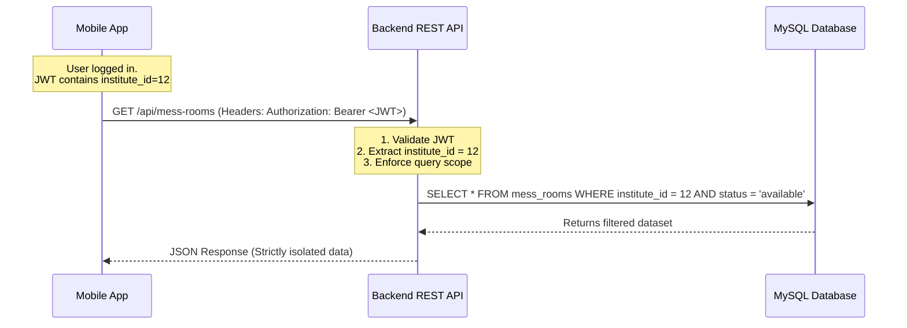

# PolyMate Architecture Blueprint & Design Specification

This document details the system architecture, folder structure, UI/UX design system, and API security guidelines for **PolyMate ("My Polytechnic")**, a premium, multi-tenant mobile platform designed for polytechnic students in Bangladesh.

---

## 1. System Architecture & Folder Structure

PolyMate uses **Expo Router v3 (File-based routing)** coupled with a **feature-first (domain-driven)** architecture. The route files in `app/` are lightweight entry points that import their corresponding views from `src/features/`. This decouples the directory structure from route files, making the project highly scalable and modular.

### Directory Structure

```text
PolyMate/
├── app/                           # Expo Router (Routing & Entry Points)
│   ├── _layout.tsx                # Root layout (Zundstand, TanStack Query, Theme Providers)
│   ├── (auth)/                    # Authentication Route Group
│   │   ├── login.tsx
│   │   └── register.tsx
│   ├── (tabs)/                    # Main Tab Navigation Group
│   │   ├── _layout.tsx            # Bottom Tab configuration
│   │   ├── index.tsx              # Home / Dashboard feed
│   │   ├── mess/                  # Mess Finder & Mess Manager sub-routes
│   │   ├── study-hub/             # Note-sharing and board questions
│   │   └── profile/               # User Settings & Expense Tracker
│   └── +not-found.tsx
├── src/                           # Main Application Source Code
│   ├── assets/                    # Static assets (fonts, icons, images)
│   ├── components/                # Core Shared UI Components (buttons, inputs, cards)
│   │   ├── Feedback/              # Toast, Skeleton loaders, Bottom Sheets
│   │   └── Layout/                # Custom status bars, safe area wrappers
│   ├── constants/                 # Theme configuration, API endpoints
│   ├── features/                  # Domain-Driven Modular Features
│   │   ├── auth/                  # State, components, api for auth
│   │   ├── mess-manager/          # Mess billing, meals, bazaar logs
│   │   │   ├── components/        # Feature-specific components
│   │   │   ├── hooks/             # TanStack Query mutations/queries
│   │   │   ├── store/             # Local Zustand slice
│   │   │   └── types/             # TypeScript contracts
│   │   ├── study-hub/             # Study material explorer
│   │   └── marketplace/           # Buy/sell board and listings
│   ├── hooks/                     # Shared custom React hooks (e.g., useDebounce, useOfflineStatus)
│   ├── services/                  # Global service singletons (SecureStore, HttpClient)
│   ├── store/                     # Global Zustand Store (Auth, Tenant/Institute state)
│   ├── types/                     # Shared TypeScript declarations
│   └── utils/                     # Formatting utilities, helper functions
├── tailwind.config.js             # NativeWind (Tailwind CSS) Configuration
└── tsconfig.json
```

---

## 2. Database Schema & Tenant Isolation Mechanics

### Multi-Tenant Isolation Flow
Every student belongs to a specific Polytechnic Institute. Direct database connections are forbidden; the mobile app connects to the REST API. The isolation is enforced at the API layer:



### Isolation Implementation Guidelines:
1. **Query Scoping**: Every database select, insert, update, or delete relating to a community feature (messes, lost & found, study hub, marketplace) MUST explicitly filter on `institute_id`.
2. **Foreign Key Enforcement**: All rows in tenant-specific tables must be bound via foreign keys referencing `institutes(id)` with `ON DELETE CASCADE`.
3. **Database Indexing**: Composite indexes on `(institute_id, status)` and `(institute_id, created_at)` are defined to prevent table scans as database rows scale.

---

## 3. UI/UX Design System

PolyMate provides a premium, native-feeling UI designed to feel elegant and professional.

### 🎨 Brand Color Palette (Sleek Emerald & Dark Slate)

We avoid basic primary green and red. The palette is tailored using modern HSL values to provide high-end contrast:

| Color Token | Hex / HSL | Usage |
| :--- | :--- | :--- |
| **Primary (Polytechnic Emerald)** | `#0D9488` / `hsl(172, 83%, 32%)` | Buttons, Active states, Branding accents |
| **Primary Light (Seafoam)** | `#CCFBF1` / `hsl(167, 85%, 90%)` | Subtle background highlights, Tag accents |
| **Background (Light Mode)** | `#F8FAFC` / `hsl(210, 40%, 98%)` | Primary page backgrounds |
| **Background (Dark Mode)** | `#0B132B` / `hsl(224, 60%, 11%)` | Sleek, night-friendly background |
| **Card (Dark Mode)** | `#1C2541` / `hsl(224, 40%, 18%)` | Elevated containers, list cards |
| **Text Dark** | `#0F172A` / `hsl(222, 47%, 11%)` | Body/Header text in light mode |
| **Text Light** | `#F1F5F9` / `hsl(210, 40%, 96%)` | Body/Header text in dark mode |
| **Accent Gold** | `#EAB308` / `hsl(45, 93%, 47%)` | Warnings, Ratings, Premium badges |

### ✍️ Typography Guidelines (System Scale)
We use a clean sans-serif typeface hierarchy (e.g., **Inter** or **Outfit**):
- **Headline (H1)**: `text-3xl font-extrabold tracking-tight` (used for main screen titles)
- **Sub-headline (H2)**: `text-xl font-bold` (used for card headings and section titles)
- **Body**: `text-base font-normal text-slate-600 dark:text-slate-300` (easy scanning)
- **Caption**: `text-xs font-semibold text-slate-400` (metadata, dates, counts)

### ✨ Component Strategy for a "Wow" Feel
1. **Skeleton Loaders (Shimmer Effect)**: Never use standard activity indicator spinners for data fetching. Standardize on React Native Reanimated skeleton cards that mimic page layouts.
2. **Glassmorphism**: Use semi-transparent backgrounds with a slight blur on header titles and overlays:
   ```javascript
   // NativeWind style
   className="bg-white/80 dark:bg-slate-900/80 backdrop-blur-md"
   ```
3. **Smooth Micro-interactions**: Use React Native Reanimated for transition effects on cards and lists. E.g., cards should animate upwards on mount.
4. **Bottom Sheets**: Use `@gorhom/bottom-sheet` for filter drawers, add-item modals, and complex workflows instead of fullscreen modals.

---

## 4. API Security Strategy for Shared Hosting

Shared hosting environments (e.g., Apache/cPanel, basic MySQL, shared IP) have constraints like restricted ports, lack of Redis access, and limited execution memory. 

### A. JWT Authentication Protocol
To secure APIs:
- Access tokens should expire in **15 minutes**.
- Store JWTs on the mobile device using **Expo SecureStore** (hardware-backed encryption) rather than AsyncStorage.
- Pass the token via the `Authorization: Bearer <TOKEN>` header.

#### Express JWT Verification Middleware:
```javascript
const jwt = require('jsonwebtoken');

module.exports = (req, res, next) => {
    const authHeader = req.headers['authorization'];
    const token = authHeader && authHeader.split(' ')[1];
    
    if (!token) return res.status(401).json({ error: 'Access token required' });
    
    jwt.verify(token, process.env.JWT_SECRET, (err, user) => {
        if (err) return res.status(403).json({ error: 'Token expired or invalid' });
        req.user = user; // Contains user.id, user.institute_id, user.role
        next();
    });
};
```

#### PHP JWT Verification (Shared Hosting Default):
```php
<?php
require 'vendor/autoload.php';
use Firebase\JWT\JWT;
use Firebase\JWT\Key;

function verify_jwt() {
    $headers = apache_request_headers();
    if (!isset($headers['Authorization'])) {
        http_response_code(401);
        echo json_encode(["error" => "Unauthorized access"]);
        exit();
    }
    
    $authHeader = $headers['Authorization'];
    list($jwt) = sscanf($authHeader, 'Bearer %s');
    
    if (!$jwt) {
        http_response_code(401);
        echo json_encode(["error" => "Format must be Bearer [token]"]);
        exit();
    }
    
    try {
        $decoded = JWT::decode($jwt, new Key($_ENV['JWT_SECRET'], 'HS256'));
        return (array) $decoded->data; // Returns user array containing institute_id
    } catch (Exception $e) {
        http_response_code(403);
        echo json_encode(["error" => "Invalid or expired token"]);
        exit();
    }
}
```

### B. Shared Hosting API Rate Limiting
Since Redis is often unavailable on shared hosting, standard node-rate-limit in-memory storage will fail under cluster modes, and PHP restarts state on every request. We implement a database or file-based rate limiter:

#### PHP File-Based Rate Limiting Strategy
Instead of hitting the DB for rate limits, write requests to temporary IP lockfiles (fast I/O):
```php
<?php
function check_rate_limit($limit = 60, $timeframe = 60) {
    $ip = $_SERVER['REMOTE_ADDR'];
    $tmpDir = sys_get_temp_dir() . '/rate_limits/';
    if (!file_exists($tmpDir)) mkdir($tmpDir, 0777, true);
    
    $file = $tmpDir . md5($ip);
    $now = time();
    $requests = [];

    if (file_exists($file)) {
        $requests = json_decode(file_get_contents($file), true);
        // Filter out expired timestamps
        $requests = array_filter($requests, function($timestamp) use ($now, $timeframe) {
            return $timestamp > ($now - $timeframe);
        });
    }

    if (count($requests) >= $limit) {
        http_response_code(429);
        echo json_encode(["error" => "Too many requests. Please try again in a minute."]);
        exit();
    }

    $requests[] = $now;
    file_put_contents($file, json_encode($requests));
}
```

#### Node.js / Express DB-Based Rate Limiter (Fallback for Shared Node Hosting)
If database is preferred over files to track limits centrally across Node.js workers without Redis:
```javascript
// Rate limiting table schema:
// CREATE TABLE rate_limits (ip VARCHAR(45), endpoint VARCHAR(100), count INT, reset_time TIMESTAMP, PRIMARY KEY(ip, endpoint));

const db = require('./db');

const rateLimiter = (limit = 100, windowMs = 60 * 1000) => {
    return async (req, res, next) => {
        const ip = req.ip;
        const endpoint = req.originalUrl;
        const now = new Date();

        try {
            const [rows] = await db.query(
                'SELECT * FROM rate_limits WHERE ip = ? AND endpoint = ?', [ip, endpoint]
            );

            if (rows.length === 0) {
                await db.query(
                    'INSERT INTO rate_limits (ip, endpoint, count, reset_time) VALUES (?, ?, 1, ?)',
                    [ip, endpoint, new Date(now.getTime() + windowMs)]
                );
                return next();
            }

            const record = rows[0];
            if (now > new Date(record.reset_time)) {
                // Reset window
                await db.query(
                    'UPDATE rate_limits SET count = 1, reset_time = ? WHERE ip = ? AND endpoint = ?',
                    [new Date(now.getTime() + windowMs), ip, endpoint]
                );
                return next();
            }

            if (record.count >= limit) {
                return res.status(429).json({ error: 'Too many requests. Please slow down.' });
            }

            await db.query(
                'UPDATE rate_limits SET count = count + 1 WHERE ip = ? AND endpoint = ?',
                [ip, endpoint]
            );
            next();
        } catch (err) {
            // Fallback gracefully on DB failure so users are not locked out
            console.error('Rate limiter database error:', err);
            next();
        }
    };
};
```
